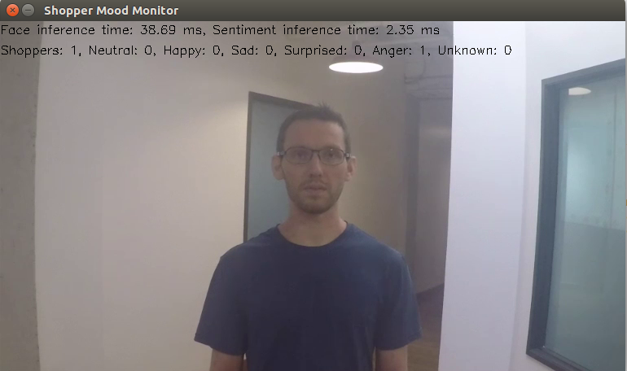

# Shopper Mood Monitor

| Details            |              |
|-----------------------|---------------|
| Target OS:            |  Ubuntu\* 16.04 LTS   |
| Programming Language: |  C++ |
| Time to Complete:    |  45 min     |



## Introduction

This shopper mood monitor application is one of a series of reference implementations for Computer Vision (CV) using the Intel® Distribution of OpenVINO™ toolkit. It is designed for a retail shelf mounted camera system that counts the number of passers-by who look towards the display and captures their mood, which is classified into 5 emotions:
- Neutral
- Happy
- Sad
- Surprised
- Anger

If the emotion cannot be determined with a level of confidence higher than the value configured via command line parameter, the emotion is marked as Unknown.

It is intended to provide real-world marketing statistics for in-store shopping mood analysis.

## Requirements

### Hardware
* 6th Generation Intel® Core™ processor with Intel® Iris® Pro graphics or Intel® HD Graphics

### Software
* [Ubuntu\* 16.04 LTS](http://releases.ubuntu.com/16.04/)<br><br>
*Note*: We recommend using a 4.14+ kernel to use this software. Run the following command to determine your kernel version:
```
uname -a
```
* OpenCL™ Runtime package
* Intel® Distribution of OpenVINO™ toolkit R5

## Setup

### Install Intel® Distribution of OpenVINO™ toolkit
Refer to https://software.intel.com/en-us/articles/OpenVINO-Install-Linux for more information about how to install and setup the Intel® Distribution of OpenVINO™ toolkit.

You will need the OpenCL™ Runtime package if you plan to run inference on the GPU as shown by the instructions below. It is not mandatory for CPU inference.

## How it Works

The application uses a video source, such as a camera, to grab the frames. It uses 2 different Deep Neural Networks (DNNs) to process the data. The first neural network detect faces. If the person's face is detected, it is counted as a "shopper".

A second neural network is then used to determine the emotion for each detected face, if the person's head is facing towards the camera.

The data can then optionally be sent to a MQTT machine to machine messaging server, as part of a retail data analytics system.

The DNN models used are Intel® optimized models that are part of the Intel® Distribution of OpenVINO™ toolkit.

You can find them here:

- `/opt/intel/computer_vision_sdk/deployment_tools/intel_models/face-detection-adas-0001`
- `/opt/intel/computer_vision_sdk/deployment_tools/intel_models/emotions-recognition-retail-0003`


The program creates three threads for concurrency:

- Main thread that performs the video i/o
- Worker thread that processes video frames using the deep neural networks
- Worker thread that publishes any MQTT messages

## Setting the Build Environment

You must configure the environment to use the Intel® Distribution of OpenVINO™ toolkit one time per session by running the following command:
```
    source /opt/intel/computer_vision_sdk/bin/setupvars.sh
```

## Build the Application

Start by changing the current directory to wherever you have git cloned the application code. For example:
```
    cd shopper-mood-monitor-cpp
```

If you do not yet have a `build` directory create one:
```
    mkdir build
```

Then change to that directory:
```
    cd build
```

Now run the following commands:
```
    cmake ..
    make
```

## Run the Application

To see a list of the various options:
```
    ./monitor -h
```

To run the application with the required models using webcam, use the below command:
```
    ./monitor -m=/opt/intel/computer_vision_sdk/deployment_tools/intel_models/face-detection-adas-0001/FP32/face-detection-adas-0001.bin -c=/opt/intel/computer_vision_sdk/deployment_tools/intel_models/face-detection-adas-0001/FP32/face-detection-adas-0001.xml -sm=/opt/intel/computer_vision_sdk/deployment_tools/intel_models/emotions-recognition-retail-0003/FP32/emotions-recognition-retail-0003.bin -sc=/opt/intel/computer_vision_sdk/deployment_tools/intel_models/emotions-recognition-retail-0003/FP32/emotions-recognition-retail-0003.xml
```
The user can choose different confidence levels for both face and emotion detection by using `--faceconf, -fc` and `--moodconf, -mc` command line parameters. By default both of these parameters are set to `0.5` i.e. at least `50%` detection confidence is required in order for the returned inference result to be considered valid.

### Hardware Acceleration

This application can take advantage of the hardware acceleration in the Intel® Distribution of OpenVINO™ toolkit by using the `-b` and `-t` parameters.

To run the application on the integrated Intel® GPU in 32-bit mode, use the below command:
```
    ./monitor -m=/opt/intel/computer_vision_sdk/deployment_tools/intel_models/face-detection-adas-0001/FP32/face-detection-adas-0001.bin -c=/opt/intel/computer_vision_sdk/deployment_tools/intel_models/face-detection-adas-0001/FP32/face-detection-adas-0001.xml -sm=/opt/intel/computer_vision_sdk/deployment_tools/intel_models/emotions-recognition-retail-0003/FP32/emotions-recognition-retail-0003.bin -sc=/opt/intel/computer_vision_sdk/deployment_tools/intel_models/emotions-recognition-retail-0003/FP32/emotions-recognition-retail-0003.xml -b=2 -t=1
```

To run the application on the integrated Intel® GPU in 16-bit mode, use the below command:
```
    ./monitor -m=/opt/intel/computer_vision_sdk/deployment_tools/intel_models/face-detection-adas-0001/FP16/face-detection-adas-0001.bin -c=/opt/intel/computer_vision_sdk/deployment_tools/intel_models/face-detection-adas-0001/FP16/face-detection-adas-0001.xml -sm=/opt/intel/computer_vision_sdk/deployment_tools/intel_models/emotions-recognition-retail-0003/FP16/emotions-recognition-retail-0003.bin -sc=/opt/intel/computer_vision_sdk/deployment_tools/intel_models/emotions-recognition-retail-0003/FP16/emotions-recognition-retail-0003.xml -b=2 -t=2
```

To run the application using the VPU, use the below command:
```
    ./monitor -m=/opt/intel/computer_vision_sdk/deployment_tools/intel_models/face-detection-adas-0001/FP16/face-detection-adas-0001.bin -c=/opt/intel/computer_vision_sdk/deployment_tools/intel_models/face-detection-adas-0001/FP16/face-detection-adas-0001.xml -sm=/opt/intel/computer_vision_sdk/deployment_tools/intel_models/emotions-recognition-retail-0003/FP16/emotions-recognition-retail-0003.bin -sc=/opt/intel/computer_vision_sdk/deployment_tools/intel_models/emotions-recognition-retail-0003/FP16/emotions-recognition-retail-0003.xml -b=2 -t=3
```

## Sample videos

There are several videos available to use as sample videos to show the capabilities of this application. You can download them by running these commands from the `shopper-mood-monitor-cpp` directory:
```
    mkdir resources
    cd resources
    wget https://github.com/intel-iot-devkit/sample-videos/raw/master/face-demographics-walking-and-pause.mp4
    wget https://github.com/intel-iot-devkit/sample-videos/raw/master/face-demographics-walking.mp4
    cd ..
```

To execute the application using one of these sample videos, run the following commands from the `shopper-mood-monitor-cpp` directory:
```
    cd build
    ./monitor -m=/opt/intel/computer_vision_sdk/deployment_tools/intel_models/face-detection-adas-0001/FP32/face-detection-adas-0001.bin -c=/opt/intel/computer_vision_sdk/deployment_tools/intel_models/face-detection-adas-0001/FP32/face-detection-adas-0001.xml -sm=/opt/intel/computer_vision_sdk/deployment_tools/intel_models/emotions-recognition-retail-0003/FP32/emotions-recognition-retail-0003.bin -sc=/opt/intel/computer_vision_sdk/deployment_tools/intel_models/emotions-recognition-retail-0003/FP32/emotions-recognition-retail-0003.xml -i=../resources/face-demographics-walking-and-pause.mp4
```

### Machine to Machine Messaging with MQTT


#### Install Mosquitto Broker
```
    sudo apt-get update
    sudo apt-get install mosquitto mosquitto-clients
```

If you wish to use a MQTT server to publish data, you should set the following environment variables before running the program:
```
    export MQTT_SERVER=localhost:1883
    export MQTT_CLIENT_ID=cvservice
```

Change the `MQTT_SERVER` to a value that matches the MQTT server you are connecting to.

You should change the `MQTT_CLIENT_ID` to a unique value for each monitoring station, so you can track the data for individual locations. For example:
```
    export MQTT_CLIENT_ID=shelf1337
```

If you want to monitor the MQTT messages sent to your local server, and you have the `mosquitto` client utilities installed, you can run the following command on a new terminal while the application is running:
```
mosquitto_sub -t 'retail/traffic'
```
