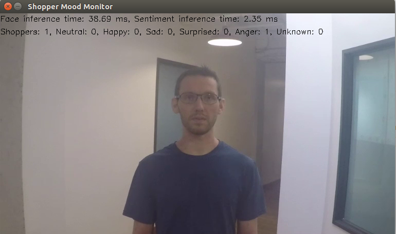
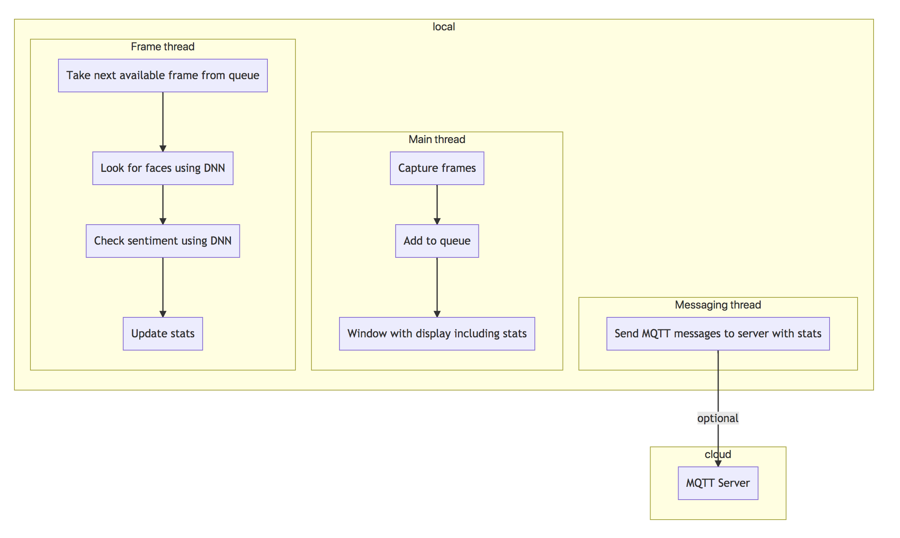

# Shopper Mood Monitor

| Details            |              |
|-----------------------|---------------|
| Target OS:            |  Ubuntu\* 18.04 LTS   |
| Programming Language: |  C++ |
| Time to Complete:    |  45 min     |



## What it does

This application designed for a retail shelf mounted camera system that counts the number of passers-by who look towards the display and captures their mood, which is classified into 5 emotions:
- Neutral
- Happy
- Sad
- Surprised
- Anger

If the emotion cannot be determined with a level of confidence higher than the value configured via command line parameter, the emotion is marked as Unknown.

It is intended to provide real-world marketing statistics for in-store shopping mood analysis.

## Requirements

### Hardware
* 6th to 8th Generation Intel® Core™ processor with Intel® Iris® Pro graphics or Intel® HD Graphics

### Software
* [Ubuntu\* 18.04 LTS](http://releases.ubuntu.com/18.04/)<br><br>
*Note*: We recommend using a 4.14+ kernel to use this software. Run the following command to determine your kernel version:
    ```
    uname -a
    ```
* OpenCL™ Runtime package
* Intel® Distribution of OpenVINO™ toolkit 2020 R3 Release


## How it Works

The application uses a video source, such as a camera, to grab the frames. It uses 2 different Deep Neural Networks (DNNs) to process the data. The first neural network detect faces. If the person's face is detected, it is counted as a "shopper".

A second neural network is then used to determine the emotion for each detected face, if the person's head is facing towards the camera.

The data can then optionally be sent to a MQTT machine to machine messaging server, as part of a retail data analytics system.



The program creates three threads for concurrency:

- Main thread that performs the video i/o
- Worker thread that processes video frames using the deep neural networks
- Worker thread that publishes any MQTT messages

## Setup

### Get the code
Clone the reference implementation
```
sudo apt-get update && sudo apt-get install git
git clone https://github.com/intel-iot-devkit/shopper-mood-monitor-cpp.git 
```

### Install Intel® Distribution of OpenVINO™ toolkit
Refer to https://software.intel.com/en-us/articles/OpenVINO-Install-Linux for more information about how to install and setup the Intel® Distribution of OpenVINO™ toolkit.

You will need the OpenCL™ Runtime package if you plan to run inference on the GPU as shown by the instructions below. It is not mandatory for CPU inference.

### Other dependencies
#### Mosquitto
Mosquitto is an open source message broker that implements the MQTT protocol. The MQTT protocol provides a lightweight method of carrying out messaging using a publish/subscribe model.

## Which model to use

This application uses the **face-detection-adas-0001** and **emotions-recognition-retail-0003** Intel® model, that can be downloaded using the **model downloader**. The **model downloader** downloads the __.xml__ and __.bin__ files that is used by the application. 

Steps to download **.xml** and **.bin** files:

To download the models and install the dependencies of the application, run the below command in the shopper-gaze-monitor-cpp directory:
```
./setup.sh
```

### The Config File

The _resources/config.json_ contains the path of video that will be used by the application as input.

For example:
   ```
   {
       "inputs": [
          {
              "video":"path_to_video/video1.mp4",
          }
       ]
   }
   ```

The `path/to/video` is the path to an input video file.

### Which Input Video to use

The application works with any input video. Find sample videos for object detection [here](https://github.com/intel-iot-devkit/sample-videos/).

For first-use, we recommend using the [face-demographics-walking-and-pause](https://github.com/intel-iot-devkit/sample-videos/blob/master/face-demographics-walking-and-pause.mp4) video.

For example:
   ```
   {
       "inputs": [
          {
              "video":"sample-videos/face-demographics-walking-and-pause.mp4",
          }
       ]
   }
   ```
If the user wants to use any other video, it can be used by providing the path in the config.json file.

### Using the Camera Stream instead of video

Replace `path/to/video` with the camera ID in the config.json file, where the ID is taken from the video device (the number X in /dev/videoX).

On Ubuntu, to list all available video devices use the following command:

```
ls /dev/video*
```

For example, if the output of above command is __/dev/video0__, then config.json would be:

```
  {
     "inputs": [
        {
           "video":"0"
        }
     ]
   }
```

### Setting the build environment

Configure the environment to use the Intel® Distribution of OpenVINO™ toolkit by exporting environment variables:

```
source /opt/intel/openvino/bin/setupvars.sh
```

__Note__: This command needs to be executed only once in the terminal where the application will be executed. If the terminal is closed, the command needs to be executed again.

## Build the Application

To build , go to the shopper-mood-monitor-cpp and run the following commands:

```
mkdir -p build
cd build
cmake ..
make
```

## Run the Application

To see a list of the various options:
```
./monitor -h
```

A user can specify what target device to run on by using the device command-line argument -d. If no target device is specified the application will run on the CPU by default.

### Run on the CPU

Although the application runs on the CPU by default, this can also be explicitly specified through the -d CPU command-line argument:

```
./monitor -m=/opt/intel/openvino/deployment_tools/open_model_zoo/tools/downloader/intel/face-detection-adas-0001/FP32/face-detection-adas-0001.bin -c=/opt/intel/openvino/deployment_tools/open_model_zoo/tools/downloader/intel/face-detection-adas-0001/FP32/face-detection-adas-0001.xml -sm=/opt/intel/openvino/deployment_tools/open_model_zoo/tools/downloader/intel/head-pose-estimation-adas-0001/FP32/head-pose-estimation-adas-0001.bin -sc=/opt/intel/openvino/deployment_tools/open_model_zoo/tools/downloader/intel/head-pose-estimation-adas-0001/FP32/head-pose-estimation-adas-0001.xml
```
The user can choose different confidence levels for both face and emotion detection by using `--faceconf, -fc` and `--moodconf, -mc` command line parameters. By default both of these parameters are set to `0.5` i.e. at least `50%` detection confidence is required in order for the returned inference result to be considered valid.

### Running on the GPU

- To run on the GPU in 32-bit mode, use the following command:
```
./monitor -m=/opt/intel/openvino/deployment_tools/open_model_zoo/tools/downloader/intel/face-detection-adas-0001/FP32/face-detection-adas-0001.bin -c=/opt/intel/openvino/deployment_tools/open_model_zoo/tools/downloader/intel/face-detection-adas-0001/FP32/face-detection-adas-0001.xml -sm=/opt/intel/openvino/deployment_tools/open_model_zoo/tools/downloader/intel/head-pose-estimation-adas-0001/FP32/head-pose-estimation-adas-0001.bin -sc=/opt/intel/openvino/deployment_tools/open_model_zoo/tools/downloader/intel/head-pose-estimation-adas-0001/FP32/head-pose-estimation-adas-0001.xml -b=2 -t=1
```
   **FP32**: FP32 is single-precision floating-point arithmetic uses 32 bits to represent numbers. 8 bits for the magnitude and 23 bits for the precision. For more information, [click here](https://en.wikipedia.org/wiki/Single-precision_floating-point_format)<br>

- To run on the GPU in 16-bit mode, use the following command:
```
./monitor -m=/opt/intel/openvino/deployment_tools/open_model_zoo/tools/downloader/intel/face-detection-adas-0001/FP16/face-detection-adas-0001.bin -c=/opt/intel/openvino/deployment_tools/open_model_zoo/tools/downloader/intel/face-detection-adas-0001/FP16/face-detection-adas-0001.xml -sm=/opt/intel/openvino/deployment_tools/open_model_zoo/tools/downloader/intel/head-pose-estimation-adas-0001/FP16/head-pose-estimation-adas-0001.bin -sc=/opt/intel/openvino/deployment_tools/open_model_zoo/tools/downloader/intel/head-pose-estimation-adas-0001/FP16/head-pose-estimation-adas-0001.xml -b=2 -t=2
```
   **FP16**: FP16 is half-precision floating-point arithmetic uses 16 bits. 5 bits for the magnitude and 10 bits for the precision. For more information, [click here](https://en.wikipedia.org/wiki/Half-precision_floating-point_format) 


### Running on the Intel® Movidius™ VPU

```
./monitor -m=/opt/intel/openvino/deployment_tools/open_model_zoo/tools/downloader/intel/face-detection-adas-0001/FP16/face-detection-adas-0001.bin -c=/opt/intel/openvino/deployment_tools/open_model_zoo/tools/downloader/intel/face-detection-adas-0001/FP16/face-detection-adas-0001.xml -sm=/opt/intel/openvino/deployment_tools/open_model_zoo/tools/downloader/intel/head-pose-estimation-adas-0001/FP16/head-pose-estimation-adas-0001.bin -sc=/opt/intel/openvino/deployment_tools/open_model_zoo/tools/downloader/intel/head-pose-estimation-adas-0001/FP16/head-pose-estimation-adas-0001.xml -b=2 -t=3
```
**Note:** The Intel® Movidius™ VPU can only run FP16 models. The model that is passed to the application, through the `-m=<path_to_model>` command-line argument, must be of data type FP16.


### Machine to Machine Messaging with MQTT


#### Install Mosquitto Broker

If you wish to use a MQTT server to publish data, you should set the following environment variables before running the program:
```
export MQTT_SERVER=localhost:1883
export MQTT_CLIENT_ID=cvservice
```

Change the `MQTT_SERVER` to a value that matches the MQTT server you are connecting to.

You should change the `MQTT_CLIENT_ID` to a unique value for each monitoring station, so you can track the data for individual locations. For example:
```
export MQTT_CLIENT_ID=shelf1337
```

If you want to monitor the MQTT messages sent to your local server, and you have the `mosquitto` client utilities installed, you can run the following command on a new terminal while the application is running:
```
mosquitto_sub -t 'retail/traffic'
```
